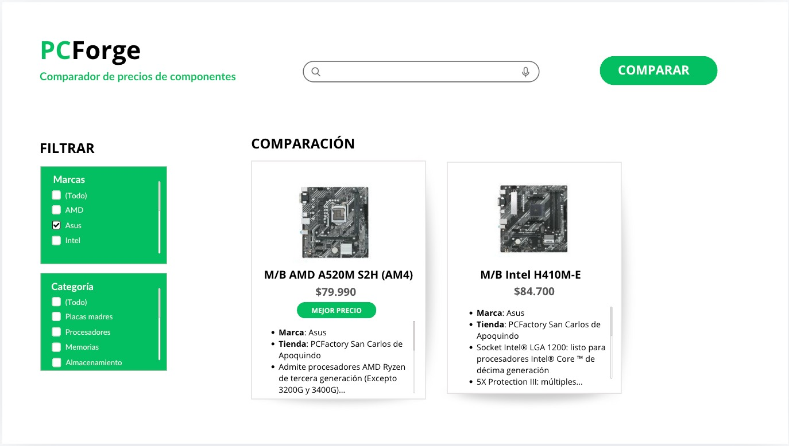

# 
# PCForge
<table>
<tr>
<td>
  PCForge es una aplicación web cuyo objetivo principal es facilitar la comparación de precios de componentes de hardware entre diferentes tiendas en línea. Es sistema está diseñado para ofrecer a los usuarios una forma rápida y eficiente de obtener información actualizada sobre los precios y la disponibilidad de componentes, ayudándoles a tomar decisiones de compra más informadas. 
</td>
</tr>
</table>

## Built with 

- [Docker](https://www.docker.com/) 
- [NodeJS](https://nodejs.org/en)
- [Express](http://expressjs.com/) 
- [React](https://react.dev/) 
- [Postgres](https://www.postgresql.org/)