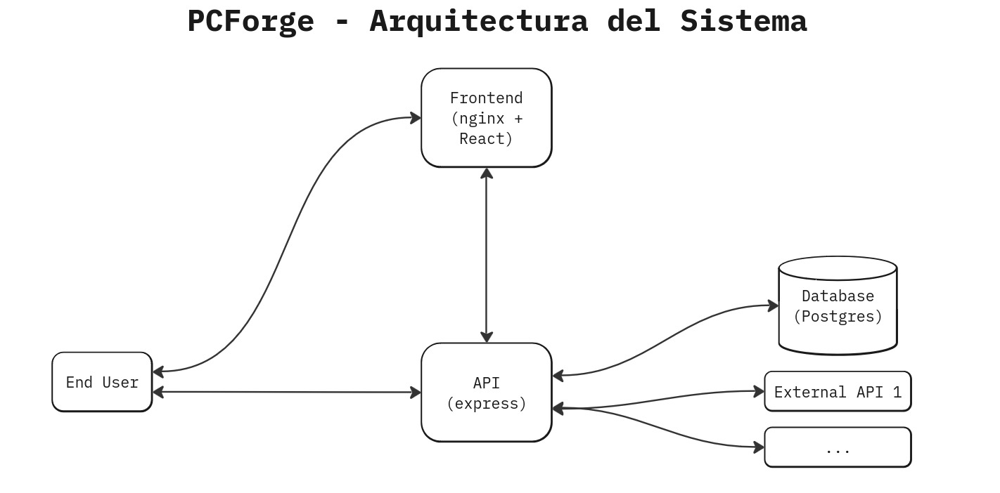
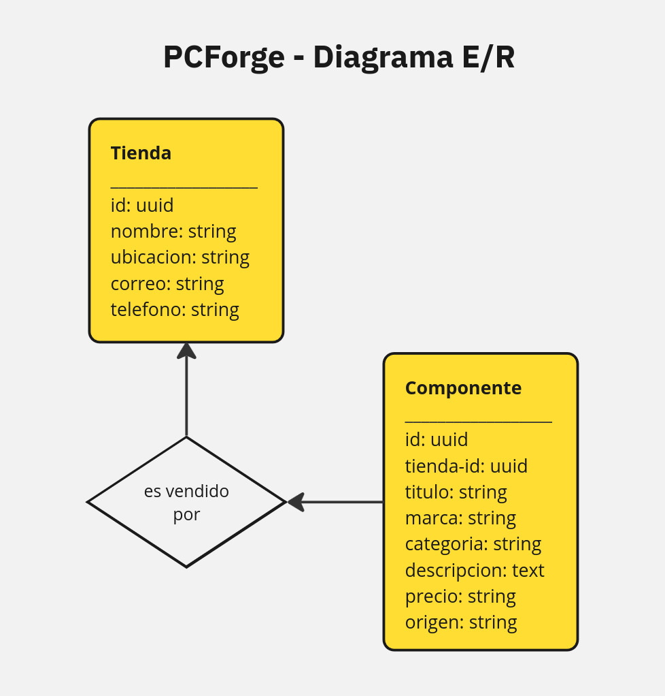

# 
# PCForge
<table>
<tr>
<td>
  PCForge es una aplicación web cuyo objetivo principal es facilitar la comparación de precios de componentes de hardware entre diferentes tiendas en línea. Es sistema está diseñado para ofrecer a los usuarios una forma rápida y eficiente de obtener información actualizada sobre los precios y la disponibilidad de componentes, ayudándoles a tomar decisiones de compra más informadas. 
</td>
</tr>
</table>

## Built with 

- [Docker](https://www.docker.com/) 
- [NodeJS](https://nodejs.org/en)
- [Express](http://expressjs.com/) 
- [React](https://react.dev/) 
- [Postgres](https://www.postgresql.org/)

## System Architecture

## E/R Diagram

## UI
Vista principal de la página, donde se observan los filtros (marca y categorías) y los componentes

Comparación de componentes: Opción 1 -> donde los detalles/descripción de los componentes se pueden ver al apretar el botón de más detalles

Comparación de componentes: Opción 2 -> donde los detalles/descripción de los componentes se pueden ver directamente en la tarjeta del componente

## Running the application
Primero copiar los archivos de variables de entorno:
1. En en directorio `/src`: `$ cp example.env .env`
2. En el directorio `/src/app`: `$ cp example.env .env`
3. En el directorio `/src/frontend/app`: `$ cp example.env .env`

Luego levantar la aplicación:
1. En el directorio `/src`: `$ sudo docker compose up -d`

Luego migrar y correr las seeds:
1. En el directorio `/src/app`: `$ npx sequelize-cli db:migrate:all && npx sequelize-cli db:seed:all`